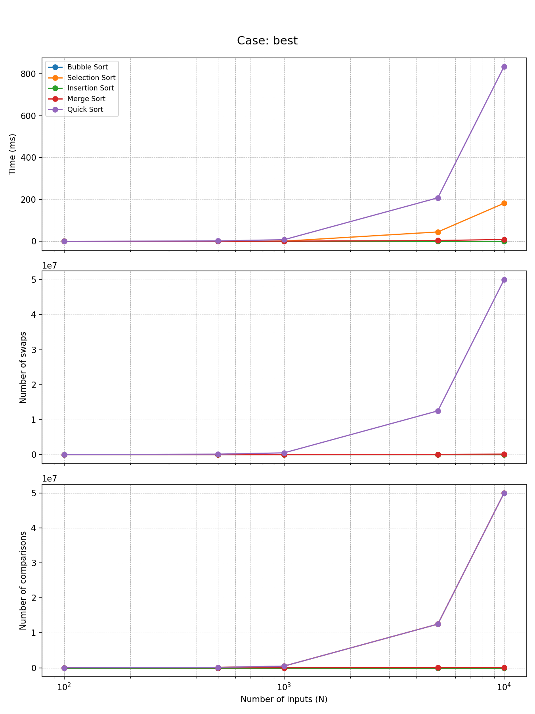
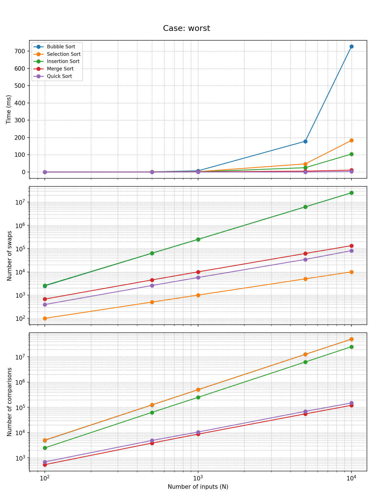

# Sorting Algorithms Benchmarks in C++

Testing 5 different sorting algorithms using the time taken, amount of swaps occured and number of comparisons to sort arrays of different sizes in their best, worst and average case.

## Sorting Algorithms Used

- Bubble Sort
- Selection Sort
- Insertion Sort
- Merge Sort
- Quick Sort

## Cases

#### Best case 

When the array is already sorted.

#### Worst case

When the array is already sorted in the opposite order of which it is supposed to be sorted by the algorithm.

#### Average case

When the array elements are in random order.

# Prerequisites

To clone, build and run this project you need:

- git version 1.7.10
- G++ compiler
- cmake 3.31.6
- python3 

## Clone the repository

``` bash 
git clone https://github.com/JestiferHarold/sorting_benchmark_cpp
```

## Build the project using cmake

```bash
cd sorting_benchmark_cpp

cmake -S . -B <any folder name prefereably build>

cmake --build <folder name>

<folder name>/debug/test
```

## Generate the plots 

### Set up the virtual enviroment

```bash
python -m venv venv
```

### Load into the virtual enviroment
 
for linux
```bash
source venv/bin/activate 
```

for windows
```bash
.\venv\Scripts\Activate.bat //for windows
```

### Download the required dependencies

```bash
pip install -r requirements.txt
```

### Run main.py to plot the graphs

```bash
python main.py
```

# Example Graphs

### Best Case


### Worst Case


### Average Case
